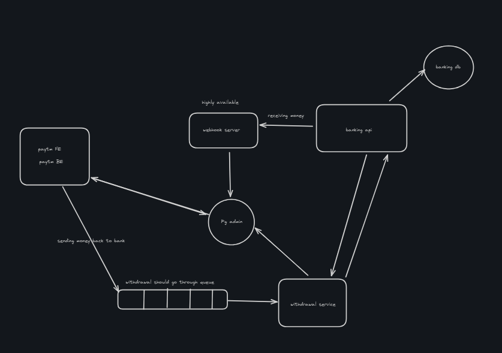

# 💳 PocketPay – Digital Wallet System

PocketPay is a modern **digital wallet** that enables **users** and **merchants** to send, receive, and withdraw money seamlessly.  
It is designed with **scalability, security, and high availability** in mind, integrating with banking APIs for smooth financial transactions.

---

## 📌 Features

- 🔑 **User Wallets** – Store and manage digital money.  
- ⚡ **Instant Payments** – Transfer money between users or to merchants in real-time.  
- 🏦 **Bank Integration** – Connect with banking APIs to deposit or withdraw funds.  
- 🔄 **Webhook Handling** – Highly available webhook server to ensure reliable transaction updates.  
- 📊 **PG Admin Panel** – Manage and monitor payment flows.  
- 📨 **Queue-based Withdrawals** – Reliable withdrawal service to avoid failures and retries.  

---

## 🏗️ Architecture

## 🛠️ Tech Stack

- **Frontend:** Next.js / React  
- **Backend:** Node.js, Express (or NestJS)  
- **Database:** PostgreSQL / MongoDB  
- **Queue:** RabbitMQ / Kafka  
- **Banking API:** Mock integration for testing  
- **Infrastructure:** Docker, Kubernetes (future scope)  

### Prerequisites
- Node.js (v18+)   
- PostgreSQL
